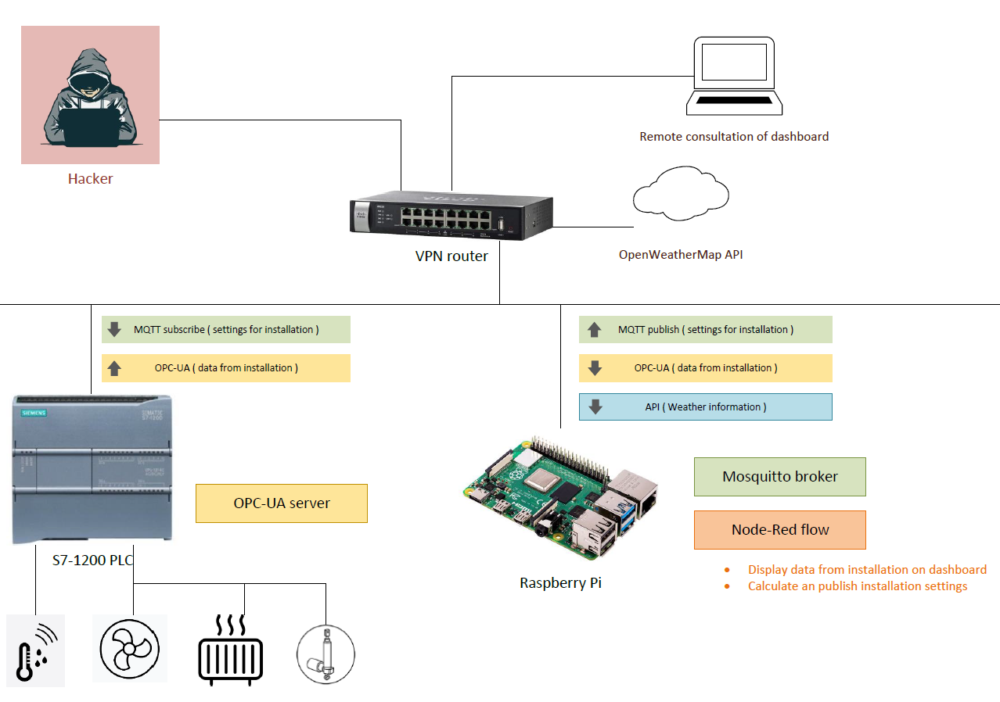
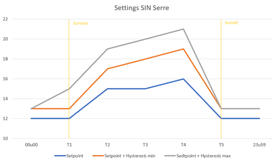

# PWO Secure Industrial Network

In this research project we focus on informing the workfield aboud vulnerabilities in there OT-IT systems.

To demonstrate this we build a demo-setup.



## Setting up the Raspberry Pi

### OS Raspberry Pi

- Install `Raspberry Pi OS` on the SD card with Raspberry Pi Imager.
- Boot the Raspberry Pi and select your user/password. For this project we used `pi` & `pwosin`.
- Setup the static IP adres (we use 172.16.12.42)
```bash
sudo nano /etc/dhcpcd.conf
```
Change the following:
```conf
interface eth0
static ip_address=172.16.12.42/16
static routers=172.16.0.0/16
static domain_name_servers=193.190.147.185
```
Use Ctrl-X to save and exit.

- Go to the preferences of the Pi and enable SSH and VNC.

- Then reboot the Pi:
```bash
sudo reboot -h 0
```
You should be able to connect to your Pi with VNC viewer.

### Install & setup the Mosquitto broker

The MQTT broker will also be hosted on the Raspberry Pi.

- Install Mosquitto
```bash
# download package information from all configured sources
sudo apt update
# install Mosquitto
sudo apt install -y mosquitto mosquitto-clients
# enable the service on startup
sudo systemctl enable mosquitto.service
```

- Setup user/password authentication
For this project we used `PWOSIN` & `SINproject2022!`
```bash
sudo mosquitto_passwd -c /etc/mosquitto/passwd <your username>
# a password will be asked
sudo nano /etc/mosquitto/mosquitto.conf
```
change/add the following:
```conf
allow_anonymous false
listener 1883 localhost
listener 8883
```

You can test the setup by connecting to Mosquitto with MQTT explorer. Use the IP adress of the Pi, port 8883 and your username/password authentication.

Note: Your device must be in the same subnet to be able to connect. If needed you can set a static IP on your device for this.

### Install & setup Node-red

Install Node-red:
```bash
# installing build-essential package
sudo apt-get install build-essential
# install node-red from github
bash <(curl -sL https://raw.githubusercontent.com/node-red/linux-installers/master/deb/update-nodejs-and-nodered)
# enable the service on startup
sudo systemctl enable nodered.service
```

Open the browser and go to `<your Pi IP-adress>:1880` to open Node-red.

Now we need to install some nodes:
- node-red-contrib-opcua
- node-red-contrib-ui-led
- node-red-dashboard
- node-red-node-openweathermap

Next we import the flow (included in this repo).

If connected to the local network as discribed in the image above the dashboard should work via `<your Pi IP-adress>:1880/ui`.

### Show dashboard on startup

To show the dashboard when the Raspberry Pi is booted we need to adjust some things.

```bash
# change directory to .config
cd .config
# add a new directory lxsession/LXDE-pi
sudo mkdir -p lxsession/LXDE-pi
# make a autostart file
sudo nano lxsession/LXDE-pi/autostart
```
Add the following content:
```ini
@lxpanel --profile LXDE-pi
@pcmanfm --desktop --profile LXDE-pi
#@xscreensaver -no-splash
point-rpi
@chromium-browser --start-fullscreen --start-maximized http://<your Pi IP-adress>:1880/ui/
```

## Calculating the setpoints

### Setpoint & hysteresis for Inside temperature

First we devide the day in 6 timeframes:
- T1 = Sunrise
- T2 = Sunrise + 2 hours
- T3 = Sunset - 4 hours
- T4 = Sunset - 2 hours
- T5 = Sunset

Next the Setpoint and Hysteresis is defined for the 6 timeframes:

00u00 to T1:
- Setpoint = 12°C
- Hysteresis = min: 1°C max: 1°C

T1 to T2:
- Setpoint = (3/120) * t + 12°C with t = minutes past T1
- Hysteresis = min: 1°C max: 1°C + (% no clouds) * 2°C

T2 to T3:
- Setpoint = 15°C
- Hysteresis = min: 2°C max: 2°C + (% no clouds) * 2°C 

T3 to T4:
- Setpoint = 16°C
- Hysteresis = min: 2°C max: 2°C + (% no clouds) * 2°C 

T4 to T5:
- Setpoint =  (-4/120) * t + 16°C with t = minutes past T4
- Hysteresis = min: 3°C max: 3°C + (% no clouds) * 2°C 

T5 to T6:
- Setpoint = 12°C
- Hysteresis = min: 1°C max: 1°C



### Setpoint for humidity

We devide the day in 3 timeframes:
- T1 = sunset - 1 hour
- T2 = 23u00

Next the setpoint is determined for the 3 timeframes:

00u00 - T1:
- Setpoint = 85%

T1 to T2:
- Setpoint = 90%

T2 to 23u59
- Setpoint = 85%